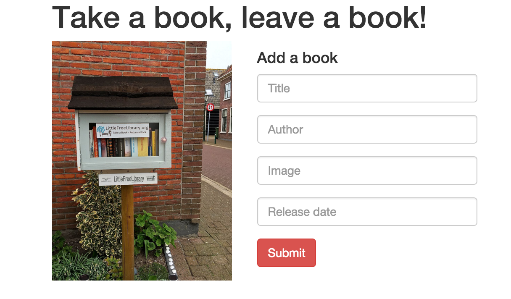

# Angular Serverless

## Link to project on Parse
[http://takeabook.parseapp.com/](http://takeabook.parseapp.com/)

--

## Process to host app
* Signed up and followed set up instructions on website
* Parse deploy

## Issues when hosting app
* Instructions are not always clear or easy to follow
* Trying to figure out Parse REST API or Parse JS SDK